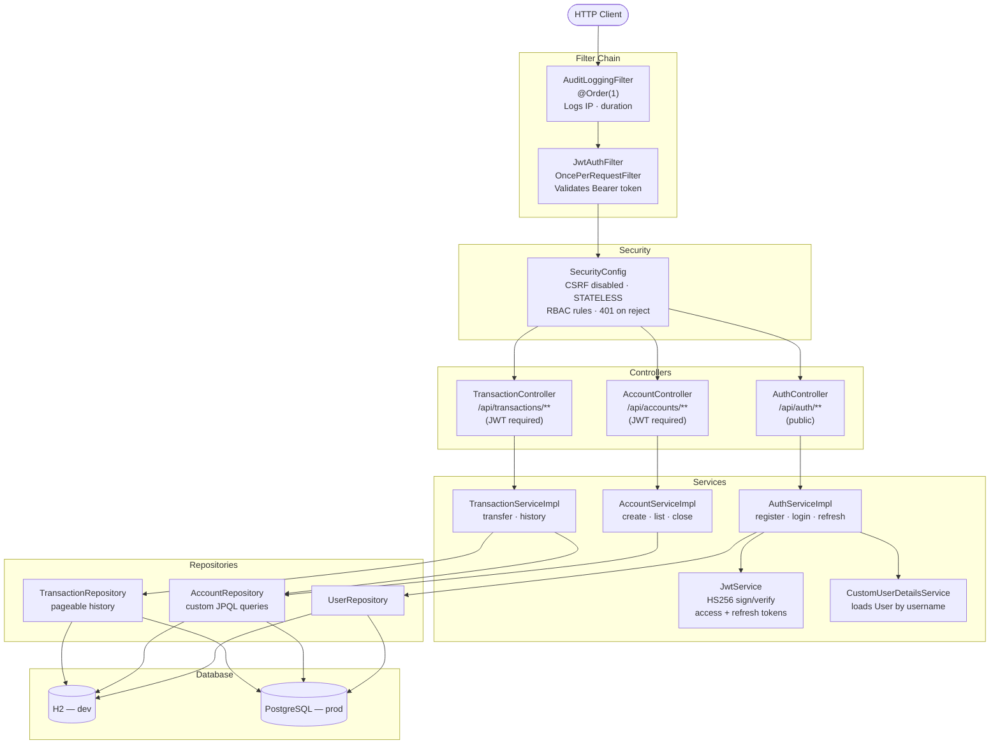

# Banking Auth API

A **production-ready JWT authentication and banking REST API** built with Java 8 and Spring Boot 2.7.  
Demonstrates stateless security, RBAC, transactional fund transfers, and Docker-based deployment.

---

## Tech Stack

| Layer | Technology |
|---|---|
| Language | Java 8 |
| Framework | Spring Boot 2.7.18 |
| Security | Spring Security 5.7 + JWT (jjwt 0.11.5) |
| Persistence | Spring Data JPA + Hibernate 5.6 |
| Database (dev) | H2 file-mode |
| Database (prod) | PostgreSQL 14 |
| API Docs | SpringDoc OpenAPI 1.7 (Swagger UI) |
| Build | Maven 3.x |
| Containerization | Docker + Docker Compose |
| CI/CD | GitHub Actions |

---

## Architecture



### Request Lifecycle

```
Request
  │
  ├─ AuditLoggingFilter    → logs [AUDIT-IN] with IP and timestamp
  ├─ JwtAuthFilter         → extracts "Authorization: Bearer <token>"
  │                           → JwtService.isTokenValid()
  │                           → sets SecurityContextHolder if valid
  ├─ SecurityConfig        → checks URL rules + method-level @PreAuthorize
  ├─ Controller            → validates @RequestBody (Bean Validation)
  ├─ Service               → business logic, @Transactional for transfers
  ├─ Repository            → JPA query to H2/PostgreSQL
  └─ AuditLoggingFilter    → logs [AUDIT-OUT] with HTTP status and duration
```

---

## Project Structure

```
banking-auth-api/
├── src/main/java/com/suraj/banking/auth/
│   ├── BankingAuthApiApplication.java
│   ├── config/
│   │   ├── SecurityConfig.java          # Spring Security + JWT filter wiring
│   │   ├── SwaggerConfig.java           # OpenAPI with Bearer scheme
│   │   └── WebMvcConfig.java            # Interceptor registration
│   ├── controller/
│   │   ├── AuthController.java          # /api/auth/**
│   │   ├── AccountController.java       # /api/accounts/**
│   │   └── TransactionController.java   # /api/transactions/**
│   ├── dto/
│   │   ├── request/   LoginRequest · RegisterRequest · TransferRequest
│   │   └── response/  ApiResponse · TokenResponse · AccountResponse · TransactionResponse
│   ├── entity/
│   │   ├── User.java · Account.java · Transaction.java
│   │   └── enums/  Role · AccountType · TransactionType
│   ├── exception/
│   │   ├── AccountNotFoundException · DuplicateUserException
│   │   ├── InsufficientFundsException · InvalidTokenException
│   │   ├── UnauthorizedAccessException
│   │   └── GlobalExceptionHandler.java  # @RestControllerAdvice
│   ├── filter/
│   │   ├── JwtAuthFilter.java           # Stateless JWT validation
│   │   └── AuditLoggingFilter.java      # Request/response audit log
│   ├── interceptor/
│   │   └── RequestLoggingInterceptor.java
│   ├── repository/
│   │   ├── UserRepository · AccountRepository · TransactionRepository
│   ├── security/
│   │   ├── JwtService.java              # Token generation & validation
│   │   └── CustomUserDetailsService.java
│   └── service/
│       ├── AuthService · AccountService · TransactionService  (interfaces)
│       └── impl/  AuthServiceImpl · AccountServiceImpl · TransactionServiceImpl
├── src/main/resources/
│   ├── application.properties           # Dev profile (H2)
│   └── application-prod.properties      # Prod profile (PostgreSQL, env vars)
├── src/test/java/
│   ├── security/JwtServiceTest.java     # 6 tests
│   ├── service/AuthServiceTest.java     # 3 tests
│   └── service/AccountServiceTest.java  # 4 tests
├── Dockerfile                           # Multi-stage: JDK build → JRE runtime
├── docker-compose.yml                   # App + PostgreSQL with healthcheck
└── .github/workflows/ci.yml            # GitHub Actions CI pipeline
```

---

## Quick Start

### Prerequisites
- Java 8+
- Maven 3.6+

### Run locally (H2 dev database)

```bash
cd banking-auth-api
mvn spring-boot:run
```

| URL | Description |
|---|---|
| `http://localhost:8080/swagger-ui.html` | Interactive Swagger UI |
| `http://localhost:8080/actuator/health` | Health check |

### Run with Docker Compose (PostgreSQL)

```bash
docker-compose up --build
```

See [docs/DEPLOYMENT.md](docs/DEPLOYMENT.md) for full deployment options.

---

## API Summary

| Method | Endpoint | Auth | Description |
|---|---|---|---|
| POST | `/api/auth/register` | — | Register new user |
| POST | `/api/auth/login` | — | Login, receive JWT |
| POST | `/api/auth/refresh` | `Refresh-Token` header | Refresh access token |
| POST | `/api/accounts` | Bearer JWT | Open new account |
| GET | `/api/accounts` | Bearer JWT | List my accounts |
| GET | `/api/accounts/{id}` | Bearer JWT | Get account details |
| DELETE | `/api/accounts/{id}` | Bearer JWT | Close account |
| POST | `/api/transactions/transfer/{fromId}` | Bearer JWT | Transfer funds |
| GET | `/api/transactions/account/{id}` | Bearer JWT | Transaction history |

See [docs/API.md](docs/API.md) for full request/response examples.

---

## Running Tests

```bash
mvn test
```

```
Tests run: 13, Failures: 0, Errors: 0, Skipped: 0
BUILD SUCCESS
```

| Test Class | Tests | What it covers |
|---|---|---|
| `JwtServiceTest` | 6 | Token generation, validation, expiry, wrong user |
| `AuthServiceTest` | 3 | Register, duplicate user, login |
| `AccountServiceTest` | 4 | Create account, list, wrong owner, not found |

---

## Key Design Decisions

| Decision | Choice | Why |
|---|---|---|
| Auth mechanism | Stateless JWT | No server-side session storage; scales horizontally |
| Token library | jjwt 0.11.5 | Type-safe builder API, fluent parser, active maintenance |
| Password storage | BCrypt | Industry standard adaptive hash; resistant to brute force |
| Exception handling | `@RestControllerAdvice` | Single place for all error responses; clean JSON output |
| Transfer atomicity | `@Transactional` | Debit + credit in one transaction; rolls back on failure |
| Ownership check | Service-layer assertion | Prevents IDOR — verifies account belongs to calling user |
| Prod config | Environment variables | No secrets in source code; 12-factor app compliant |
