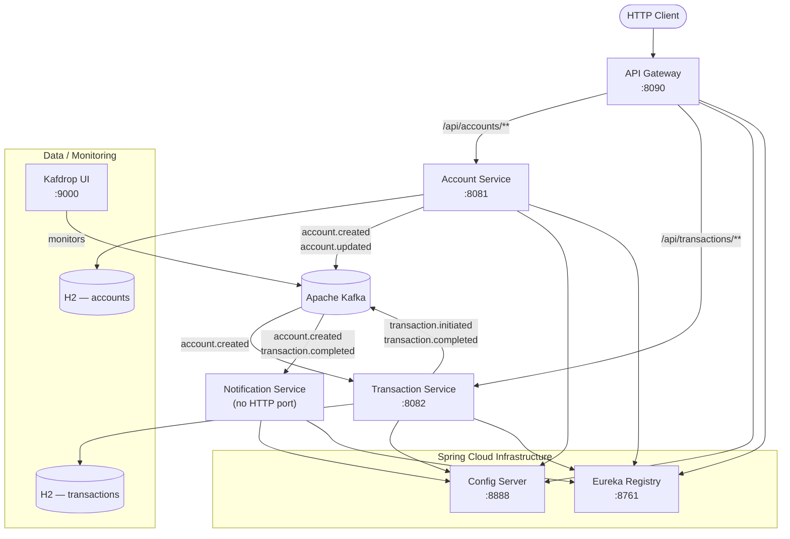

# Banking Core Microservices

> An event-driven banking core backend built with **Spring Boot**, **Spring Cloud**, **Apache Kafka**, and **Docker** — demonstrating production-grade microservices patterns on Java 8.


---

## Table of Contents

- [Overview](#-overview)
- [Architecture](#-architecture)
- [Tech Stack](#-tech-stack)
- [Services](#-services)
- [Quick Start](#-quick-start)
- [API Reference](#-api-reference)
- [Kafka Event Pipeline](#-kafka-event-pipeline)
- [Java 8 Features Showcase](#-java-8-features-showcase)
- [Configuration](#-configuration)
- [Project Structure](#-project-structure)

---

## Overview

Six loosely-coupled services communicate asynchronously through Kafka, with centralised configuration, dynamic service discovery, and a reactive API gateway — all containerised with Docker Compose.

**Key design highlights:**

- **Centralised config** — Spring Cloud Config Server (native profile) serves all service config at startup; clients use `bootstrap.yml` with exponential-backoff retry
- **Event-driven** — account creation and fund transfers trigger Kafka events consumed by downstream services without direct coupling
- **Non-blocking retries** — `@RetryableTopic` + `@DltHandler` on the notification consumer; failed messages are retried 3× with 1.5× exponential backoff before landing in the dead-letter topic (visible in Kafdrop)
- **Configurable ports** — every port uses `${ENV_VAR:default}` — override via `.env`, OS env var, or JVM `-D` flag with zero code changes
- **Java 8 idiomatic** — `Optional`, `Stream` + `Predicate` composition, `CompletableFuture` used throughout (not just for syntax, but to solve real domain problems)

---

## Architecture



---

## Tech Stack

| Layer | Technology | Version |
|---|---|---|
| Language | Java | 8 |
| Framework | Spring Boot | 2.7.18 |
| Microservices | Spring Cloud | 2021.0.8 |
| Service Discovery | Netflix Eureka | via Spring Cloud |
| Config Management | Spring Cloud Config | native profile |
| API Gateway | Spring Cloud Gateway | reactive |
| Messaging | Apache Kafka (Confluent) | 7.4.x |
| Kafka UI | Kafdrop | latest |
| Persistence | H2 in-memory (dev) / PostgreSQL-ready (prod) | — |
| ORM | Spring Data JPA + Hibernate | 5.6.x |
| API Docs | SpringDoc OpenAPI (Swagger UI) | 1.7.0 |
| Containerisation | Docker + Docker Compose | v3.8 |
| Build | Apache Maven | 3.9.x |
| Testing | JUnit 5 + Spring Boot Test + EmbeddedKafka | — |

---

## Services

| Service | Port | Responsibility | Kafka Role |
|---|---|---|---|
| **config-server** | `8888` | Serves YAML config to all clients at bootstrap time | — |
| **service-registry** | `8761` | Eureka server — service registration + client-side load balancing | — |
| **api-gateway** | `8090` | Routes `/api/accounts/**` and `/api/transactions/**`; integrates with Eureka for `lb://` routing | — |
| **account-service** | `8081` | Account CRUD; generates `ACC-XXXXXXXX` numbers; publishes domain events | Producer |
| **transaction-service** | `8082` | Fund transfers (INITIATED → COMPLETED in one call); consumes account events | Producer + Consumer |
| **notification-service** | none | `WebApplicationType.NONE` — pure Kafka consumer; async notifications via `CompletableFuture` | Consumer |

---

## Quick Start

### Prerequisites

- **Docker Desktop 20+** *(recommended — no local JDK/Kafka needed)*
- OR: JDK 8, Maven 3.9, Apache Kafka for local run without Docker

### With Docker Compose

```bash
# Clone
git clone https://github.com/suraj-suryn/banking-core-microservices.git
cd banking-core-microservices

# Build images & start all 10 services (first run: ~5–10 min)
docker-compose up -d --build

# Windows shortcut:
start-services.bat
```

Services start in dependency order enforced by `depends_on: condition: service_healthy`:

```
zookeeper → kafka → config-server → service-registry
         → account-service, transaction-service, notification-service
         → api-gateway
```

### Access Points

| Service | URL |
|---|---|
| **Kafdrop** (Kafka UI — inspect topics, messages, DLT) | http://localhost:9000 |
| **Eureka Dashboard** (registered services) | http://localhost:8761 |
| **API Gateway** | http://localhost:8090 |
| **Account Swagger UI** | http://localhost:8081/swagger-ui.html |
| **Transaction Swagger UI** | http://localhost:8082/swagger-ui.html |

### Stop

```bash
docker-compose down
# Windows:
stop-services.bat
```

### Override Any Port (no code change)

```bash
# Edit .env before starting:
GATEWAY_PORT=9090
ACCOUNT_SERVICE_PORT=9081

# Or pass inline:
GATEWAY_PORT=9090 docker-compose up -d
```

---

## API Reference

All endpoints are accessible directly on the service port **or** via the **API Gateway** at `:8090`.

### Account Service — `/api/accounts`

| Method | Path | Description |
|---|---|---|
| `POST` | `/api/accounts` | Create a new bank account |
| `GET` | `/api/accounts/{id}` | Get account by ID |
| `GET` | `/api/accounts/number/{accountNumber}` | Get account by account number |
| `GET` | `/api/accounts/user/{userId}` | Get all active accounts for a user |
| `DELETE` | `/api/accounts/{id}` | Deactivate an account |

**Create Account:**

```bash
curl -s -X POST http://localhost:8090/api/accounts \
  -H "Content-Type: application/json" \
  -d '{
    "userId": "user-001",
    "accountType": "SAVINGS",
    "initialBalance": 5000.00
  }' | jq
```

```json
{
  "success": true,
  "message": "Account created successfully",
  "data": {
    "id": "a1b2c3d4-e5f6-...",
    "accountNumber": "ACC-83921047",
    "userId": "user-001",
    "accountType": "SAVINGS",
    "balance": 5000.00,
    "active": true,
    "createdAt": "2026-07-02T10:00:00"
  }
}
```

> **Event fired:** `account.created` → consumed by transaction-service and notification-service

### Transaction Service — `/api/transactions`

| Method | Path | Description |
|---|---|---|
| `POST` | `/api/transactions/transfer` | Initiate a fund transfer between two accounts |
| `GET` | `/api/transactions/{accountId}` | Get transaction history for an account |
| `GET` | `/api/transactions/detail/{id}` | Get a specific transaction by ID |

**Initiate Transfer:**

```bash
curl -s -X POST http://localhost:8090/api/transactions/transfer \
  -H "Content-Type: application/json" \
  -d '{
    "fromAccountId": "a1b2c3d4-...",
    "toAccountId":   "e5f6g7h8-...",
    "amount": 1500.00,
    "description": "Monthly rent payment"
  }' | jq
```

```json
{
  "success": true,
  "message": "Transfer completed successfully",
  "data": {
    "id": "txn-0001-...",
    "fromAccountId": "a1b2c3d4-...",
    "toAccountId": "e5f6g7h8-...",
    "amount": 1500.00,
    "type": "TRANSFER",
    "status": "COMPLETED",
    "description": "Monthly rent payment",
    "createdAt": "2026-07-02T10:05:00",
    "completedAt": "2026-07-02T10:05:00"
  }
}
```

> **Events fired:** `transaction.initiated` → `transaction.completed` → consumed by notification-service

---

## Kafka Event Pipeline

```
Account Service                 Topics                     Consumers
──────────────────              ─────────────────────      ──────────────────────────────
createAccount()       ──────▶   account.created      ──▶  transaction-service (caches IDs)
                                                      ──▶  notification-service (welcome msg)

updateAccount()       ──────▶   account.updated       ──▶  (extensible — add audit service)

Transaction Service             Topics                     Consumers
──────────────────              ─────────────────────      ──────────────────────────────
initiateTransfer()    ──────▶   transaction.initiated  ──▶  (extensible — ledger / audit)
                      ──────▶   transaction.completed   ──▶  notification-service (alert)
```

### Non-Blocking Retry + Dead-Letter Topic

The notification consumer uses `@RetryableTopic` (spring-kafka 2.8.x, auto-configured — no `@EnableRetryTopic` needed):

```java
@RetryableTopic(
    attempts = "4",                                     // 1 attempt + 3 retries
    backoff = @Backoff(delay = 1000, multiplier = 1.5), // 1s → 1.5s → 2.25s
    autoCreateTopics = "true"
)
@KafkaListener(topics = "transaction.completed", groupId = "notification-service-group")
public void onTransactionCompleted(String payload) throws JsonProcessingException { ... }

@DltHandler
public void handleDeadLetter(String payload) {
    // Dead messages inspectable in Kafdrop at http://localhost:9000
}
```

### Why `StringDeserializer` on notification-service?

The service listens on two topics carrying two different event types (`AccountEvent`, `TransactionEvent`). `JsonDeserializer` requires a single fixed target class. Using `StringDeserializer` + `ObjectMapper.readValue()` per listener allows type-safe deserialization without Spring's JSON type headers — keeping services fully decoupled.

---

## Java 8 Features Showcase

| Service | Java 8 Feature | Example |
|---|---|---|
| account-service | `Optional.ofNullable` | `Optional.ofNullable(request.getInitialBalance()).orElse(BigDecimal.ZERO)` |
| account-service | Stream + `Comparator.comparing` | `.stream().filter().sorted(Comparator.comparing(Account::getCreatedAt).reversed()).collect()` |
| account-service | `Optional` + method chain | `.findById(id).map(this::mapToResponse).orElseThrow(() -> new AccountNotFoundException(...))` |
| transaction-service | `Predicate<T>` field | `Predicate<BigDecimal> isPositiveAmount = amount -> amount.compareTo(BigDecimal.ZERO) > 0` |
| transaction-service | `Predicate.and()` | `isNonEmptyString.and(s -> !s.equals(request.getToAccountId())).test(request.getFromAccountId())` |
| transaction-service | Stream filter + collect | `.stream().filter(t -> t.getStatus() != FAILED).map(this::mapToResponse).collect(Collectors.toList())` |
| notification-service | `CompletableFuture.supplyAsync` | `CompletableFuture.supplyAsync(() -> { log.info(...); return true; }).exceptionally(ex -> false)` |
| All producers | Lambda callbacks | `kafkaTemplate.send(...).addCallback(r -> log.info(...), ex -> log.error(...))` |

---

## Configuration

All ports use `${ENV_VAR:default}` — override without touching a single line of source code.

| Service | Env Var | Default |
|---|---|---|
| Config Server | `CONFIG_SERVER_PORT` | `8888` |
| Eureka | `REGISTRY_PORT` | `8761` |
| API Gateway | `GATEWAY_PORT` | `8090` |
| Account Service | `ACCOUNT_SERVICE_PORT` | `8081` |
| Transaction Service | `TRANSACTION_SERVICE_PORT` | `8082` |
| Kafka | `KAFKA_PORT` | `9092` |
| Kafdrop | `KAFDROP_PORT` | `9000` |
| PostgreSQL | `POSTGRES_PORT` | `5432` |

**Docker:** edit [`.env`](.env)  
**Local JVM:** `java -DACCOUNT_SERVICE_PORT=9081 -jar account-service.jar`  
**Spring Cloud Config:** values in `config-server/src/main/resources/configurations/*.yml` — change once, all instances pick it up at startup

---

## Project Structure

```
banking-core-microservices/
├── pom.xml                              # Parent BOM — Spring Boot 2.7.18, Spring Cloud 2021.0.8
├── docker-compose.yml                   # 10 services: infra + 6 Spring Boot apps
├── .env                                 # Port defaults (safe to commit — no secrets)
├── start-services.bat                   # Windows: build + docker-compose up
├── stop-services.bat                    # Windows: docker-compose down
│
├── config-server/                       # Spring Cloud Config (native profile)
│   └── src/main/resources/
│       ├── application.yml
│       └── configurations/              # Per-service YAML config files
│           ├── account-service.yml      # port, H2, Kafka producer, Eureka
│           ├── transaction-service.yml  # port, H2, Kafka producer + consumer
│           ├── notification-service.yml # Kafka StringDeserializer config
│           └── api-gateway.yml          # Gateway routes, port 8090
│
├── service-registry/                    # Eureka Server
├── api-gateway/                         # Spring Cloud Gateway (reactive)
│
├── account-service/
│   └── src/
│       ├── main/java/.../account/
│       │   ├── entity/Account.java      # @PrePersist: UUID id + ACC-XXXXXXXX number gen
│       │   ├── service/impl/            # Optional, Stream, Comparator — Java 8 patterns
│       │   └── event/                   # AccountEventProducer → account.created/updated
│       └── test/                        # AccountKafkaIntegrationTest (@EmbeddedKafka)
│
├── transaction-service/
│   └── src/
│       ├── main/java/.../transaction/
│       │   ├── service/impl/            # Predicate<T> composition, Stream filter
│       │   ├── event/                   # TransactionEventProducer
│       │   └── consumer/               # AccountEventConsumer (ConcurrentHashMap.newKeySet())
│       └── test/                        # TransactionServiceIntegrationTest (H2 + EmbeddedKafka)
│
├── notification-service/               # WebApplicationType.NONE — no Tomcat
│   └── src/
│       ├── main/java/.../notification/
│       │   ├── consumer/               # @RetryableTopic + @DltHandler
│       │   └── service/                # CompletableFuture async notifications
│       └── test/                        # NotificationConsumerTest (@SpyBean + EmbeddedKafka)
│
└── docs/
    └── Implementation-Notes.html        # Dark-themed living doc: 11 architectural decisions,
                                         # each with before/after analysis + verification status
```

---

## Implementation Notes

A living HTML document tracks every significant architectural decision in this project:

- **#1** Configurable ports via `${ENV_VAR:default}` ✓ WORKING
- **#2** `bootstrap.yml` + `spring-cloud-starter-bootstrap` for config client ✓ WORKING
- **#3** Config Server native profile (classpath-based, no Git required) ✓ WORKING
- **#4** Config client retry with exponential backoff ✓ WORKING
- **#5** `notification-service` as `WebApplicationType.NONE` ✓ WORKING
- **#6** `NewTopic` beans for auto-creating Kafka topics at startup ✓ WORKING
- **#7** API Gateway on port `8090` (avoids conflict with companion project) ✓ WORKING
- **#8** `@EmbeddedKafka` tests with `bootstrapServersProperty` ✓ WORKING
- **#9** `@RetryableTopic` without `@EnableRetryTopic` on spring-kafka 2.8.x ✓ WORKING
- **#10** Docker Compose startup ordering via `depends_on: condition: service_healthy` ✓ WORKING

Open [`docs/Implementation-Notes.html`](docs/Implementation-Notes.html) in a browser for the full before/after analysis.

---

*Part of a personal portfolio showcasing microservices, event-driven architecture, and Java 8 patterns.*
